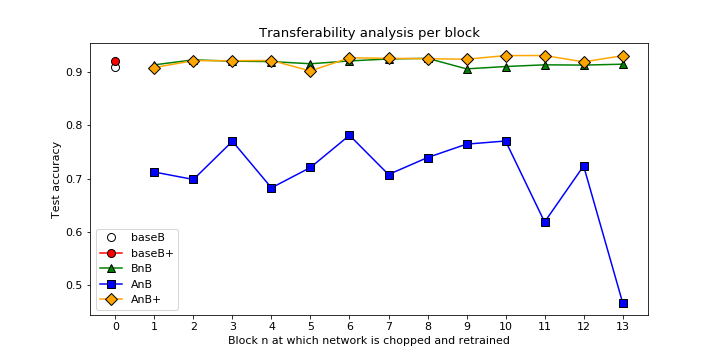

# feature-transfer

about Transfer learning  (survey Pan)

The objective of this work is to investigate different transfer learning setups for the target task of lane following using only frontal images and a discretized control (forward, left, right). The source task is image classification for the ImageNet Large Scale Visual Recognition Challenge (ILSVRC).

#### Techniques for feature transfer learning

+ __frozen__ - the weights learned on the source (base) network are copied to the target network and they're kept frozen during training (i.e. the errors from training the target network are not backpropagated to these layers)
+ __fine-tuning__ - the weights of the target network are initialized with the weights from the base network and are fine-tuned during training

[//]: # "images taken with a frontal camera mounted on top of a toy remote control car"
[//]: # "undersampling method was used to balance the self-driving dataset"

## Experiments

Following [\[1\]](#References) the first thing to do is to train **base** networks for both tasks. For this study the chosen architecture was [MobileNet v1](https://arxiv.org/abs/1704.04861). Since there is a mismatch in the number of classes (1000 for ImageNet and 3 for lane following), only the top layers will be different throughout this experiment.

+ __baseA__ - MobileNet model, with weights pre-trained on ImageNet (1000 categories and 1.2 million images) 
+ __baseB__ - MobileNet model, with weights randomly initialized trained on [self-driving dataset](https://github.com/paulaksm/self_driving_data) (3 categories and 50k images)

BaseA model is not available in this repository because it's downloaded directly from Keras Applications.

BaseB achieved 91% accuracy on validation and was trained for 15 epochs. BaseB model is available at `transfer/trained-models/baseB.h5`.

There is also a __baseB+__ model, available on `transfer/trained-models/baseBfinetune.h5`,  with weights initialized using the ImageNet pre-trained model and fine-tuned on task B. This model achieved 92% accuracy on validation and was trained for 15 epochs.

#### Self-driving dataset distribution info

##### Training (total: 56172)

+ left = 16141
+ right = 10425
+ forward = 29606

##### Validation (total: 7022)

+ left = 2034
+ right = 1336
+ forward = 3652

##### Test (total: 4086)

+ left = 1362
+ right = 1362
+ forward = 1362

### Experiment setup

The MobileNet architecture consists of one regular convolutional layer (input), 13 depthwise separable convolutional blocks, one fully-connected layer and a softmax layer for classification.

The __selffer network BnB__ investigates the interaction between blocks; frozen some and training others for the same task. 

Example: `B3B` - the first 3 blocks are copied from `baseB.h5` model and frozen. The following blocks are randomly initialized and trained on the self-driving dataset. This network is a control for the `transfer network (AnB)`.

The __transfer network AnB__ investigates transferability of blocks between different tasks. Intuitively, if AnB performs as well as `baseB`, there is evidence that until the `n-block` the features are general in respect of task B.

Example: `A3B` - the first 3 blocks are copied from MobileNet model trained on ImageNet (task A) and frozen. The following blocks are randomly initialized and trained on the self-driving dataset (task B).

The __transfer network AnB+__ just like AnB, but there is no frozen weights. All layers learn during training on task B.

The following figure is a compilation of all the experiments. All the colected data is available at [experiments-results](transfer/plots/README.md).



As also reported in [3], there are no fragile co-adapted features on successive layers. This phenomenon happens when gradient descent can find a good solution when the network is initially trained but not after re-initializing some layers and then retraining them.

### Conclusions

* Given the amount of training data available for the target domain, there was not a significant advantage of using transfer learning in task B.

* As reported in [1], initializing the network with weights trained on a different task, rather than random initialization, can improve performance (+1% accuracy) on the target task.

* The poor results for transfer network AnB can be viewed as a negative transfer between tasks. Indicating that the actual feature extractors learned for task A are not useful for task B images.

----------------------------------------------------------------------------------------------------------------------------------

## Transferability analysis as a naive-pruning technique

In this section, we will explore the transferability of features as a straightforward method of layer pruning in CNNs. The main idea is to chop MobileNet at _n_ adding a pooling layer, a fully-connected layer and a softmax classifier and finetune it for task B.

The table below shows the performance of each sub-network trained up to 15 epochs. 

| n | val_acc | test_acc |
|----|---------|----------|
| 1 | 0.7677 | 0.7430 |
| 2 | 0.7930 | 0.7905 |
| 3 | 0.8036 | 0.7929 |
| 4 | 0.8160 | 0.8098 |
| 5 | 0.8212 | 0.7907 |
| 6 | 0.8303 | 0.8272 |
| 7 | 0.8444 | 0.8284 |
| 8 | 0.8887 | 0.8749 |
| 9 | 0.8675 | 0.8695 |
| 10 | 0.9050 | 0.9011 |
| 11 | 0.9152 | 0.9111 |

It is evident that at n=11 the accuracy on test set is equal to the performance of `baseB` model, and down by 1% if compared to `baseB+` (finetuned version of baseB). Given this similar performance, the study of transferability of features may be seen as a __naive approach for layer pruning__. 

The following table shows a comparison between a sliced model at block n=11 and `baseB+` model.

|  | memory size | inference time | #parameters | accuracy |
|------------|:-----------:|:----------------:|:-----------:|:--------:|
| sliced n11 | 13M | 13 sec. 3ms/step | 1M | 91.94% |
| base B+ | 25M  | 13 sec. 3ms/step | 3M | 92.31% |

Even though there is no change in inference time, the reduction of footprint memory still may be of help to constraint resources systems.

## Installation

<!-- Use the package manager [pip](https://pip.pypa.io/en/stable/) to install foobar.

```bash
pip install foobar
``` -->

#### Downloading dataset

The script to download the dataset for **task B** is available at [self-driving data repository](https://github.com/paulaksm/self_driving_data). 

You can place the created folder `data/` wherever you like, but _don't rename the `.npy` files_.

<!-- ## Usage

```python
import foobar

foobar.pluralize('word') # returns 'words'
foobar.pluralize('goose') # returns 'geese'
foobar.singularize('phenomena') # returns 'phenomenon'
``` -->

## Contributing
Pull requests are welcome. For major changes, please open an issue first to discuss what you would like to change.

Please make sure to update tests as appropriate.

## License
[MIT](https://choosealicense.com/licenses/mit/)

## References
[1] [How transferable are features in deep neural networks?](https://arxiv.org/abs/1411.1792)

[2] [A Survey on Transfer Learning](https://ieeexplore.ieee.org/document/5288526)

[3] [Does Fragile Co-Adaptation Occur in Small Datasets](https://ieeexplore.ieee.org/abstract/document/8406745)